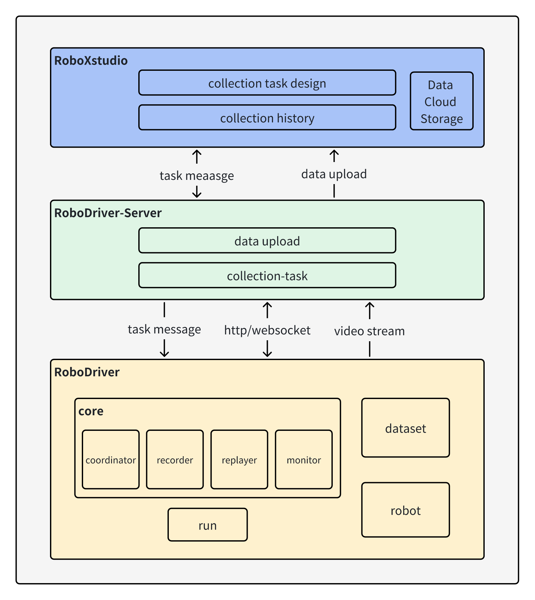

[](https://github.com/FlagOpen/RoboDriver/issues)
[](https://github.com/FlagOpen/RoboDriver/discussions)

[](./README_en.md)
[](./README.md)

# RoboDriver

## Overview

RoboDriver is the core driver-layer component of DataCollect and serves as the standardized robot access module within the [CoRobot](https://github.com/FlagOpen/CoRobot) data stack.

<p align="center">
  
</p>

As shown above, RoboDriver acts as the device-side driver adaptation layer. [RoboDriver-Server](https://github.com/FlagOpen/RoboDriver-Server) is the data/control bridge layer and channel router, and [RoboXStudio](https://ei2data.baai.ac.cn/home) is the cloud- or platform-side console and data management center.

RoboDriver documentation: [RoboDriver-Doc](https://flagopen.github.io/RoboDriver-Doc)

## Latest News

- [2025-12-16] RoboDriver-Simulation and AutoDriver officially released
- [2025-12-01] RoboDriver project open sourced

## Table of Contents

1. [Overview](#overview)
2. [Key Features](#key-features)
3. [Quick Start](#quick-start)
4. [Simulation Examples](#simulation-examples)
5. [Robot Examples](#robot-examples)
6. [Contributing](#contributing)
7. [Support](#support)
8. [License and Acknowledgements](#license-and-acknowledgements)
9. [Citation](#citation)

## Key Features

- **Multiple Robot Integration Methods**: RoboDriver supports integration beyond SDKs, including ROS and Dora.
- **LeRobot Compatibility**: RoboDriver's robot interface directly uses LeRobot's `Robot` class, which means RoboDriver and LeRobot are mutually compatible.
- **Enhanced LeRobot Dataset Format**: Different data structures are used at different stages of data handling. Data is stored as individual entries at the collection end for easier editing and transmission. The format also extends the original LeRobot specification.

## Quick Start

Please refer to the project documentation: [RoboDriver-Doc](https://flagopen.github.io/RoboDriver-Doc)

Quick installation:

First, clone the RoboDriver repository and enter the project directory:

```bash
git clone https://github.com/FlagOpen/RoboDriver.git && cd RoboDriver
```

Install `uv` without activating any environment:

```bash
pip install uv
```

Create a uv environment:

```bash
uv venv -p 3.10
```

Install the project:

```bash
uv pip install -e .
```

Usage:

```bash
source .venv/bin/activate
robodriver-run -h
```

To use a specific robot, install the corresponding robot package and follow its documentation to complete deployment and startup. Path: `robodriver/robots/robodriver-robot-xxx-xxx-xxx/README.md`

## Simulation Examples

Considering the various uncertainties of robots in real-world environments, we recommend that you first try using `RoboDriver` with the `simulation examples` we provide.

RoboDriver has completed adaptation for the `Genesis` simulation environment. Adaptation for environments like `mujoco` and `isaac sim` is under development. For usage, please refer to the project documentation and the `README` in the corresponding folders within the repository.

### 🪞 Genesis

| Robot Model | Description | Repository Link | Contributor |
|------------|------|--------------|------------------------|
| Franka Robot Arm | A Franka robot arm grasping a block | [robodriver/simulations/robodriver-sim-genesis-franka-aio-dora](./robodriver/simulations/robodriver-sim-genesis-franka-aio-dora) | [](https://github.com/Ryu-Yang) |

## Robot Examples
RoboDriver has completed adaptation for multiple mainstream robots. Examples by integration method are as follows (each repository contains complete guidelines for the corresponding robot's integration steps, environment configuration, command adaptation, etc.):

### 🔌 ROS1 Integration
| Robot Model | Description | Code Link | Contributor |
|------------|------|--------------|------------------------|
| DeepRobotics X30 | DeepRobotics X30 quadruped robot, contributed by Inspur Cloud Information Technology Co., Ltd. | [robodriver/robots/robodriver-robot-deeprobotics-x30-ros1](./robodriver/robots/robodriver-robot-deeprobotics-x30-ros1) | [](https://github.com/jiangjb01) [](https://github.com/wangqi951002) |
| GALAXEALITE | Based on Galaxealite, dual-arm 6DOF+end gripper, ROS1 integration | [robodriver/robots/robodriver-robot-galaxealite-aio-ros1](./robodriver/robots/robodriver-robot-galaxealite-aio-ros1) | [](https://github.com/liuyou) |
| Realman Robot Arm | Based on Realman, 6DOF+force control module, 3*RealSense cameras | [robodriver/robots/robodriver-robot-realman-aio-ros1](./robodriver/robots/robodriver-robot-realman-aio-ros1) | [](https://github.com/zhanglei-web) |
| Leju Kuavo 4 Pro | Leju Kuavo 4 Pro robot data collection program | [robodriver/robots/robodriver-robot-leju-kuavo-teleoperate-ros1](./robodriver/robots/robodriver-robot-leju-kuavo-teleoperate-ros1) | [](https://github.com/dirk656) |

### 🔌 ROS2 Integration
| Robot Model | Description | Code Link | Contributor |
|--------------|--------------------------------------------------------------|------------------------------------------------------------------------------------------|------------------------|
| GALAXEALITE | Based on Galaxealite, dual-arm 6DOF+end gripper, 4*RealSense cameras | [robodriver/robots/robodriver-robot-galaxealite-aio-ros2](./robodriver/robots/robodriver-robot-galaxealite-aio-ros2) | [](https://github.com/liuyou1103) |
| Galbot G1 | Galbot G1 AIO ROS2 DDS integration example | [robodriver/robots/robodriver-robot-galbot-g1-aio-ros2-dds](./robodriver/robots/robodriver-robot-galbot-g1-aio-ros2-dds) | [](https://github.com/Ryu-Yang) |
| SO101 Robot Arm | Open-source lightweight robot arm, 6DOF+end gripper, 1*RealSense camera, 1*RGB camera module | [robodriver/robots/robodriver-robot-so101-aio-ros2](./robodriver/robots/robodriver-robot-so101-aio-ros2) | [](https://github.com/Ryu-Yang) |
| Dobot Nova2 | Dobot Nova2 robot arm ROS2 integration example, contributed by Inspur Cloud Information Technology Co., Ltd. | [robodriver/robots/robodriver-robot-dobot-nova2-ros2](./robodriver/robots/robodriver-robot-dobot-nova2-ros2) | [](https://github.com/jiangjb01) [](https://github.com/wangqi951002) |
| OpenArm | OpenArm dual-arm teleoperation ROS2 integration example | [robodriver/robots/robodriver-robot-openarm-teleoperate-ros2](./robodriver/robots/robodriver-robot-openarm-teleoperate-ros2) | Hanyu Feng |

### 🔌 Dora (SDK) Integration
| Robot Model | Description | Code Link | Contributor |
|--------------|--------------------------------------------------------------|------------------------------------------------------------------------------------------|------------------------|
| AgileX Aloha | AgileX Aloha dual-arm robot AIO Dora integration example | [robodriver/robots/robodriver-robot-agilex-aloha-aio-dora](./robodriver/robots/robodriver-robot-agilex-aloha-aio-dora) | [](https://github.com/Ryu-Yang) |
| Realman Robot Arm | Based on Realman, 6DOF+force control module, 3*RealSense cameras | [robodriver/robots/robodriver-robot-realman1-aio-dora](./robodriver/robots/robodriver-robot-realman1-aio-dora) | [](https://github.com/XuRuntian) |
| SO101 Robot Arm | Open-source lightweight robot arm, 6DOF+end gripper, 1*RealSense camera, 1*RGB camera module | [robodriver/robots/robodriver-robot-so101-aio-dora](./robodriver/robots/robodriver-robot-so101-aio-dora) | [](https://github.com/Ryu-Yang) |
| Franka | Industrial-grade robot arm, 6DOF+end gripper, 1*RealSense camera | [robodriver/robots/robodriver-robot-franka-aio-dora](./robodriver/robots/robodriver-robot-franka-aio-dora) | [](https://github.com/XuRuntian) |

### 🔌 SDK Integration

| Robot Model | Description | Code Link | Contributor |
|--------------|--------------------------------------------------------------|------------------------------------------------------------------------------------------|------------------------|
| Galbot G1 | Galbot G1 AIO SDK Python integration example | [robodriver/robots/robodriver-robot-galbot-g1-aio-sdk-py](./robodriver/robots/robodriver-robot-galbot-g1-aio-sdk-py) | [](https://github.com/Ryu-Yang) |
| Galbot G1 | Galbot G1 AIO SDK RC integration example | [robodriver/robots/robodriver-robot-galbot-g1-aio-sdk-rc](./robodriver/robots/robodriver-robot-galbot-g1-aio-sdk-rc) | [](https://github.com/Ryu-Yang) |
| Unitree G1 | Unitree humanoid robot G1, contributed by Inspur Cloud Information Technology Co., Ltd. | [robodriver/robots/robodriver-robot-unitree-g1-sdk-py](./robodriver/robots/robodriver-robot-unitree-g1-sdk-py) | [](https://github.com/hixiaobo) |

> ✨ Notes:
> 1. Integration method naming convention: `robodriver-robot-[robot model]-[teleoperation method]-[integration type]` (e.g., `aio`/`follower`/`teleoperate`, `ros2`/`dora`);
> 2. Each adaptation repository contains **complete integration guidelines including environment setup, configuration modifications, and collection/control verification**;
> 3. Continuously adding adapted robots; please follow this list or project updates.

We warmly welcome community developers to contribute implementations for more robots! You can participate in the following ways:
1. Refer to the code structure and README template of already adapted robots, complete adaptation development according to integration type (ROS1/ROS2/Dora);
2. Add the adaptation code to the main repository's `robodriver/robots/` directory (naming convention consistent with already adapted robots);
3. Ensure code standardization and complete documentation (including environment preparation, configuration steps, functional verification);
4. Submit code PR to the main repository's `dev` branch, and we will review and merge promptly.

Looking forward to enriching RoboDriver's robot ecosystem together with you! 🤝

## Contributing

We sincerely welcome *any form of contribution* from the community. Whether it's **pull requests for new features**, **bug reports**, or even **small suggestions** to make RoboDriver more user-friendly—we deeply appreciate all contributions!

## Support

- Please use GitHub [Issues](https://github.com/FlagOpen/RoboDriver/issues) to report bugs and request new features.
- Please use GitHub [Discussions](https://github.com/FlagOpen/RoboDriver/discussions) to share ideas and ask questions.

## License and Acknowledgements

RoboDriver's source code is licensed under the Apache 2.0 License. This project would not be possible without the following amazing open-source projects:

- Thanks to the LeRobot team for open-sourcing 🤗 [LeRobot](https://github.com/huggingface/lerobot). RoboDriver is built as an improvement upon LeRobot.
- Thanks to TheRobotStudio team for open-sourcing the SO-100 and SO-101 robot arms 🤗 [SO-101](https://github.com/TheRobotStudio/SO-ARM100). The SO-101 arm is used as a deployment example in this project.
- Thanks to the dora-rs team for open-sourcing their robotics framework 🤗 [dora](https://github.com/dora-rs/dora). This framework enables a novel integration method for robots in this project.

## Citation

```bibtex
@misc{RoboDriver,
  author = {RoboDriver Authors},
  title = {RoboDriver: A robot control and data acquisition framework},
  month = {November},
  year = {2025},
  url = {https://github.com/FlagOpen/RoboDriver}
}
```
